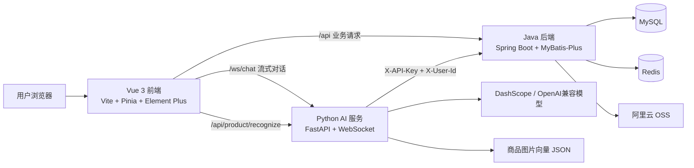

# 无人超市智能导购系统

一个面向无人超市场景的全栈项目，包含 Vue 前端、Spring Boot Java 业务后端、FastAPI Python AI 服务端。系统围绕“无人超市购物 + AI 导购 + 商品识别 + 订单结算 + 用户个性化模型配置”构建，用户可以通过普通页面完成购物流程，也可以通过 AI 导购助手进行自然语言购物、页面跳转、购物车操作、订单创建和商品图片识别。

## 项目背景

传统无人超市系统通常只覆盖商品浏览、购物车、支付、后台管理等基础功能。为了让购物过程更接近真实导购体验，本项目引入 AI Agent：用户可以直接说“帮我买两瓶可乐”“看看我的购物车”“推荐一些饮料”，AI 会结合后端业务接口和前端页面工具完成搜索、确认、加入购物车、创建订单、跳转页面等操作。

同时，项目支持商品图片识别。用户上传商品图片后，Python AI 服务会使用多模态向量模型生成图片向量，与商品向量库进行相似度匹配，从而识别商品并加入购物车。

为了便于开源和多人部署，项目还加入了用户级 AI 模型配置能力：

- 聊天模型配置：每个用户可以在个人中心配置自己的模型厂商、Base URL、模型名称和 API Key。
- 图片识别配置：每个用户可以单独配置阿里百炼 DashScope API Key，用于多模态商品图片识别。
- 如果用户不配置，则回退到服务端环境变量中的默认配置。

## 核心功能

### 用户端功能

- 用户注册、登录、退出登录
- JWT 登录态维护
- 个人资料查看与修改
- 适老化模式开关
- 商品浏览、分类筛选、热销商品展示
- 商品详情查看
- 购物车添加、修改、删除
- 订单创建、订单支付、订单取消
- 历史订单查询与订单详情查看
- 商品图片上传识别
- AI 导购助手对话购物
- AI 悬浮窗与全屏助手页同步流式输出
- 用户个人 AI 模型配置
- 用户个人图片识别 DashScope Key 配置

### 管理端功能

- 商品管理
- 商品上架/下架
- 商品图片上传到 OSS
- 用户分页管理
- 用户角色调整
- 订单列表与订单详情查看

### AI 导购能力

- WebSocket 流式对话
- 支持 ReAct 工具调用流程
- 可调用后端商品、购物车、订单接口
- 可控制前端导航和点击行为
- 支持 ask_user 弹窗确认，避免 AI 自行猜测
- 支持会话持久化与历史会话列表
- 支持任务进度跟踪
- 支持模型不兼容 tools 时的降级处理

## 技术架构



### 三端职责

| 模块 | 目录 | 主要职责 | 默认端口 |
| --- | --- | --- | --- |
| 前端 | `unmannedSupermarket前端` | 页面展示、路由、登录态、购物流程、AI 助手 UI、个人中心模型配置 | `5173` |
| Java 后端 | `unmannedSupermarket后端java` | 用户、商品、购物车、订单、OSS、权限、模型配置持久化 | `8065` |
| Python AI 后端 | `unmannedSupermarket后端AI` | AI Agent、WebSocket 流式对话、工具调用、图片识别、会话历史 | `8000` |

## 技术栈

### 前端

- Vue 3
- TypeScript
- Vite
- Pinia
- Vue Router
- Element Plus
- Axios

### Java 后端

- Java 17
- Spring Boot 4.0.6
- MyBatis-Plus 3.5.15
- MySQL
- Redis
- JWT
- Lombok
- 阿里云 OSS SDK

### Python AI 后端

- Python 3.10+
- FastAPI
- Uvicorn
- OpenAI Python SDK
- HTTPX
- PyYAML
- Pillow
- PyMySQL
- python-multipart

### AI / 多模态

- 聊天模型默认：DashScope OpenAI 兼容接口，`qwen3.6-plus`
- 聊天模型要求：需要支持 tools / function calling，AI 导购依赖工具调用能力
- 图片识别默认：DashScope multimodal embedding，`qwen3-vl-embedding`
- 商品图片识别方式：上传图片向量与商品向量库做余弦相似度匹配

## 目录结构

```text
D:\新建文件夹 (3)
├─ README.md
├─ LICENSE
├─ .gitignore
├─ init_database.sql
├─ unmannedSupermarket前端
│  ├─ package.json
│  ├─ vite.config.ts
│  ├─ public
│  ├─ docs
│  └─ src
│     ├─ api                 # Axios API 封装
│     ├─ assets              # 静态资源
│     ├─ components          # 通用组件、AI 悬浮窗、商品管理组件
│     ├─ composables          # Toast 等组合式逻辑
│     ├─ router              # 前端路由
│     ├─ stores              # Pinia 状态管理
│     ├─ types               # TypeScript 类型定义
│     ├─ utils               # 工具函数
│     └─ views               # 页面视图
│
├─ unmannedSupermarket后端java
│  ├─ pom.xml
│  ├─ product_data.sql
│  ├─ user_multimodal_model_config.sql
│  ├─ api.md
│  └─ src
│     ├─ main
│     │  ├─ java/com/itheima/unmannedsupermarket
│     │  │  ├─ common        # Result、JWT、Redis、API Key、密钥加密工具
│     │  │  ├─ config        # 拦截器、跨域、Redis、MyBatis-Plus 配置
│     │  │  ├─ controller    # REST API 控制器
│     │  │  ├─ dto           # 请求 DTO
│     │  │  ├─ entity        # 数据库实体
│     │  │  ├─ enums         # 枚举
│     │  │  ├─ mapper        # MyBatis-Plus Mapper
│     │  │  ├─ service       # 业务接口与实现
│     │  │  ├─ task          # 定时任务
│     │  │  └─ vo            # 响应 VO
│     │  └─ resources
│     │     ├─ application.yml
│     │     └─ mapper
│     └─ test
│
└─ unmannedSupermarket后端AI
   ├─ app.py                 # FastAPI 入口
   ├─ config.yaml            # 默认聊天模型和系统提示词配置
   ├─ requirements.txt
   ├─ product_vector_recognizer.py
   ├─ session_manager.py
   ├─ task_tracker.py
   ├─ agent
   │  ├─ api_client.py       # Python 调 Java 后端客户端
   │  └─ shopping_agent.py   # AI 导购 Agent 主逻辑
   ├─ scripts
   │  └─ build_product_image_vectors.py
   ├─ data
   │  └─ product_image_vectors.json
   └─ history                # 本地会话历史，开源时可不提交
```

## 环境准备

### 必需环境

- Node.js 18+
- JDK 17
- Maven 3.8+
- Python 3.10+
- MySQL 8+
- Redis 6+

### 推荐工具

- IntelliJ IDEA / VS Code
- Navicat / DataGrip / MySQL Workbench
- Git

## 环境变量说明

### Java 后端

| 变量名 | 作用 | 是否必需 | 默认值 |
| --- | --- | --- | --- |
| `JAVA_INTERNAL_API_KEY` | Java 与 Python 内部调用认证 Key，必须与 Python 保持一致 | 推荐设置 | `lhmdejavaapi` |
| `AI_CONFIG_SECRET` | 用户模型 API Key 加密密钥 | 推荐设置 | 回退 `jwt.secret` |
| `OSS_ACCESS_KEY_SECRET` | 阿里云 OSS Secret | 使用文件上传时必需 | 无 |

> 开源前请检查 `application.yml`，不要提交真实数据库密码、OSS 密钥、生产 JWT 密钥等敏感信息。建议改成环境变量或示例配置。

### Python AI 后端

| 变量名 | 作用 | 是否必需 | 默认值 |
| --- | --- | --- | --- |
| `DASHSCOPE_API_KEY` | 默认聊天模型和默认图片识别使用的 DashScope API Key | 不配置用户 Key 时必需 | 无 |
| `JAVA_INTERNAL_API_KEY` | 调用 Java 内部接口的认证 Key | 推荐设置 | `lhmdejavaapi` |
| `DASHSCOPE_MULTIMODAL_EMBEDDING_URL` | DashScope 多模态 embedding 地址 | 否 | 内置 DashScope 地址 |
| `PRODUCT_VECTOR_OUTPUT` | 商品图片向量文件路径 | 否 | `data/product_image_vectors.json` |
| `PRODUCT_VECTOR_MODEL` | 生成商品向量时使用的模型 | 否 | `qwen3-vl-embedding` |
| `PRODUCT_VECTOR_DIMENSION` | 向量维度 | 否 | `1024` |

### 前端

| 变量名 | 作用 | 是否必需 | 默认值 |
| --- | --- | --- | --- |
| `VITE_AI_WS_URL` | 自定义 AI WebSocket 地址 | 否 | 根据当前域名拼接 `/ws/chat` |

开发环境下，Vite 已配置代理：

- `/api/session`、`/api/product/recognize`、`/api/product/vector-status`、`/ws` 转发到 Python `localhost:8000`
- 其他 `/api` 请求转发到 Java `localhost:8065`

## 数据库初始化

项目根目录提供了完整初始化脚本 `init_database.sql`，包含：

- 完整业务表结构
- 3 个默认账号
- 全部 50 条商品数据
- 示例购物车和示例订单数据
- 用户聊天模型配置表和用户多模态模型配置表

执行方式：

```bash
cd "D:\新建文件夹 (3)"
mysql -u root -p < init_database.sql
```

默认账号：

| 用户名 | 密码 | 角色 |
| --- | --- | --- |
| `superadmin` | `123456` | 超级管理员 |
| `admin` | `123456` | 管理员 |
| `user` | `123456` | 普通用户 |

如果你不想清空已有数据，请不要直接执行该脚本。它会重建业务表，用于本地开发、演示和开源仓库快速启动。

## 启动步骤

建议按以下顺序启动：MySQL、Redis、Java 后端、Python AI 后端、前端。

### 1. 启动 MySQL 和 Redis

确保 MySQL 中已有 `unmanned_supermarket` 数据库，并且 `application.yml` 中的数据源配置正确。

Redis 默认配置：

```yaml
host: localhost
port: 6379
database: 0
```

### 2. 启动 Java 后端

```bash
cd unmannedSupermarket后端java

# Windows PowerShell 示例
$env:JAVA_INTERNAL_API_KEY="lhmdejavaapi"
$env:AI_CONFIG_SECRET="please-change-this-secret"
$env:OSS_ACCESS_KEY_SECRET="your-oss-secret"

# 使用 Maven Wrapper
.\mvnw.cmd spring-boot:run

# 或使用本机 Maven
mvn spring-boot:run
```

启动成功后默认监听：

```text
http://localhost:8065
```

### 3. 启动 Python AI 后端

```bash
cd unmannedSupermarket后端AI

# 创建虚拟环境
python -m venv .venv

# Windows PowerShell 激活虚拟环境
.\.venv\Scripts\Activate.ps1

# 安装依赖
pip install -r requirements.txt

# 默认 DashScope Key，用户没有个人配置时会使用它
$env:DASHSCOPE_API_KEY="your-dashscope-api-key"

# 与 Java 后端 api.key 保持一致
$env:JAVA_INTERNAL_API_KEY="lhmdejavaapi"

# 启动服务
.\.venv\Scripts\python.exe -m uvicorn app:app --host 0.0.0.0 --port 8000 --reload
```

启动成功后默认监听：

```text
http://localhost:8000
```

### 4. 生成或更新商品图片向量库

商品图片识别依赖 `data/product_image_vectors.json`。如果你新增了商品图片，建议重新生成向量：

```bash
cd unmannedSupermarket后端AI

# 全量生成
.\.venv\Scripts\python.exe .\scripts\build_product_image_vectors.py

# 中断后续跑
.\.venv\Scripts\python.exe .\scripts\build_product_image_vectors.py --resume
```

常用可选环境变量：

```bash
PRODUCT_DB_HOST=localhost
PRODUCT_DB_PORT=3306
PRODUCT_DB_NAME=unmanned_supermarket
PRODUCT_DB_USER=root
PRODUCT_DB_PASSWORD=123456
PRODUCT_VECTOR_MODEL=qwen3-vl-embedding
PRODUCT_VECTOR_DIMENSION=1024
```

### 5. 启动前端

```bash
cd unmannedSupermarket前端

npm install
npm run dev
```

启动成功后访问：

```text
http://localhost:5173
```

## 打包构建

### 前端构建

```bash
cd unmannedSupermarket前端
npm run build
```

构建产物位于：

```text
unmannedSupermarket前端/dist
```

### Java 后端打包

```bash
cd unmannedSupermarket后端java
mvn clean package -DskipTests
```

构建产物位于：

```text
unmannedSupermarket后端java/target
```

### Python 后端

Python 服务无需传统打包，生产环境可使用 `uvicorn`、`gunicorn + uvicorn worker`、Docker 或进程管理工具部署。

## AI 模型配置说明

### 聊天模型

入口：前端个人中心 -> AI 模型配置。

可配置内容：

- 模型厂商：DashScope、OpenAI、DeepSeek、Moonshot、自定义 OpenAI 兼容接口
- Base URL
- 模型名称
- API Key
- Temperature
- Max Tokens
- Top P
- 是否启用

重要说明：AI 导购需要调用工具完成购物车、订单和页面操作，因此选择的聊天模型必须支持 tools / function calling。如果模型不支持工具调用，AI 可能只能普通聊天，无法稳定完成自动购物流程。

未配置时默认使用 Python `config.yaml`：

```yaml
llm:
  api_key_env: "DASHSCOPE_API_KEY"
  base_url: "https://dashscope.aliyuncs.com/compatible-mode/v1"
  model: "qwen3.6-plus"
```

### 图片识别多模态配置

入口：前端个人中心 -> 图片识别模型配置。

当前图片识别向量库固定使用 DashScope `qwen3-vl-embedding` 生成，因此这里仅允许用户配置阿里百炼 DashScope API Key，不会复用 OpenAI、DeepSeek、Moonshot 等聊天模型厂商的 Key。

未配置时默认使用服务端环境变量：

```text
DASHSCOPE_API_KEY
```

## 主要接口概览

### Java 后端接口

- `POST /api/user/login`：登录
- `POST /api/user/register`：注册
- `GET /api/user/info`：当前用户信息
- `PUT /api/user/info`：修改用户信息
- `PUT /api/user/elderly-mode`：切换适老化模式
- `GET /api/product/page`：商品分页
- `GET /api/product/listed`：已上架商品分页
- `GET /api/product/detail/{id}`：商品详情
- `POST /api/product/add`：新增商品
- `PUT /api/product/update/{id}`：修改商品
- `PUT /api/product/status/{id}`：上下架商品
- `GET /api/cart/page`：购物车列表
- `POST /api/cart-item/add`：加入购物车
- `PUT /api/cart-item/update`：修改购物车明细
- `POST /api/orders`：创建订单
- `POST /api/orders/{id}/pay`：支付订单
- `POST /api/orders/{id}/cancel`：取消订单
- `GET /api/user/ai-model`：查询用户聊天模型配置
- `PUT /api/user/ai-model`：保存用户聊天模型配置
- `GET /api/user/multimodal-model`：查询用户图片识别配置
- `PUT /api/user/multimodal-model`：保存用户图片识别配置

### Python AI 接口

- `GET /api/health`：健康检查
- `GET /api/product/vector-status`：图片向量库状态
- `POST /api/product/recognize`：商品图片识别
- `POST /api/session/create`：创建 AI 会话
- `GET /api/session/list`：会话列表
- `GET /api/session/{session_id}/messages`：会话消息
- `DELETE /api/session/{session_id}`：删除会话
- `WS /ws/chat`：AI 导购 WebSocket 流式对话

## 开源前建议清理

建议不要提交以下内容：

```text
node_modules/
dist/
target/
.venv/
__pycache__/
*.pyc
server.log
server.err.log
server.out.log
history/
.env
*.local
```

如果 `data/product_image_vectors.json` 较大，可以根据开源目标决定是否提交。提交它可以让图片识别开箱即用；不提交则需要使用脚本重新生成。

请务必检查：

- `application.yml` 中是否有真实数据库密码
- OSS AccessKey 是否已经移到环境变量
- `DASHSCOPE_API_KEY` 是否没有写入代码
- `JAVA_INTERNAL_API_KEY` 是否生产环境已改成强随机值
- `AI_CONFIG_SECRET` 是否生产环境已改成强随机值
- GitHub 仓库是否添加了合适的 `.gitignore`

## 常见问题

### 1. AI 提示 `DASHSCOPE_API_KEY` 未设置

说明当前用户没有配置个人模型，且 Python 服务端环境变量也没有设置。解决方式：

- 在个人中心配置聊天模型或图片识别 DashScope Key
- 或在启动 Python 服务前设置 `DASHSCOPE_API_KEY`

### 2. AI 能聊天但不能操作购物车或订单

通常是模型不支持 tools / function calling。请在个人中心选择支持工具调用的聊天模型。

### 3. 图片识别报错或识别不准

检查以下内容：

- `data/product_image_vectors.json` 是否存在
- 向量库模型是否为 `qwen3-vl-embedding`
- `DASHSCOPE_API_KEY` 或用户图片识别 DashScope Key 是否可用
- 新增商品后是否重新生成商品图片向量

### 4. Python 调 Java 接口失败

检查 Java 和 Python 的 `JAVA_INTERNAL_API_KEY` 是否一致，Java 默认端口是否为 `8065`。

### 5. 前端请求失败

检查：

- Java 后端是否启动在 `8065`
- Python AI 后端是否启动在 `8000`
- Vite 是否启动在 `5173`
- `vite.config.ts` 代理是否被修改

## 许可证

本项目采用 Apache License 2.0 开源许可证，完整条款见根目录 `LICENSE` 文件。
